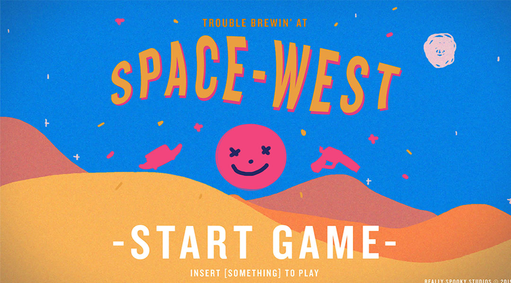
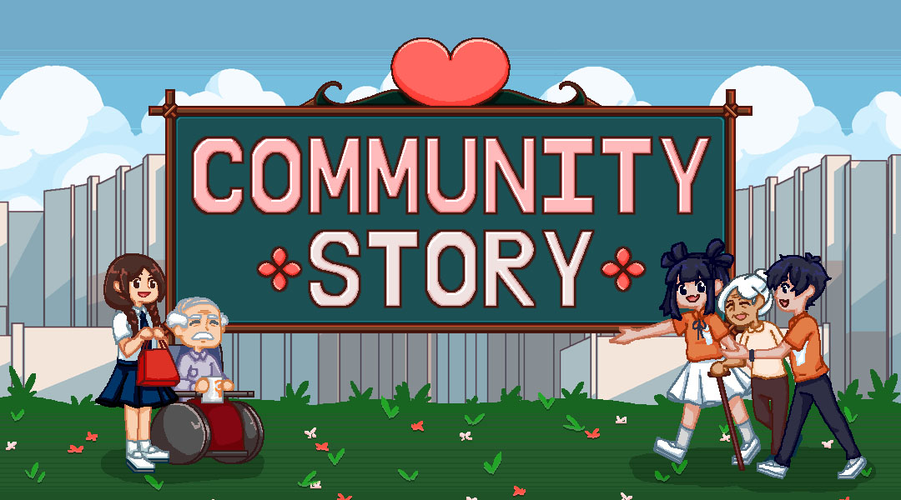
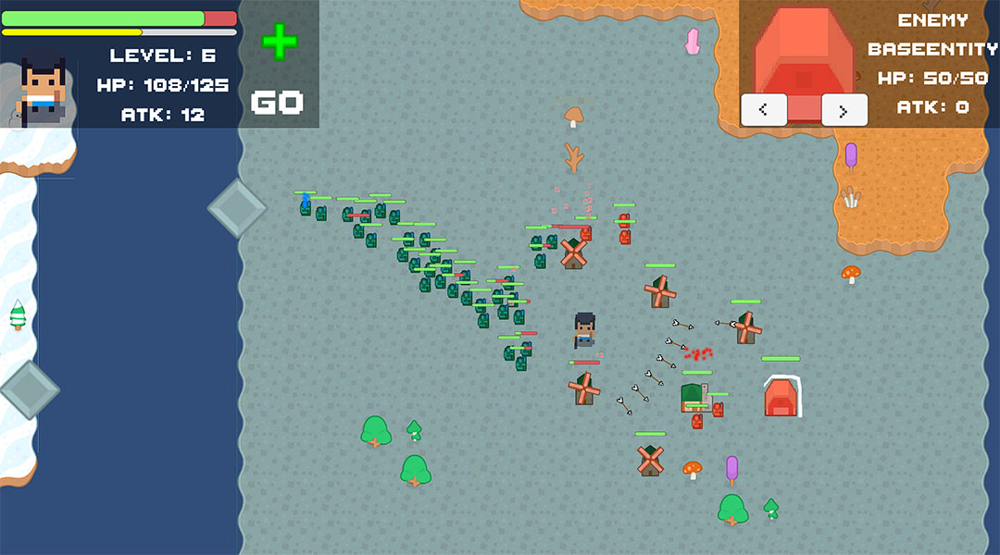
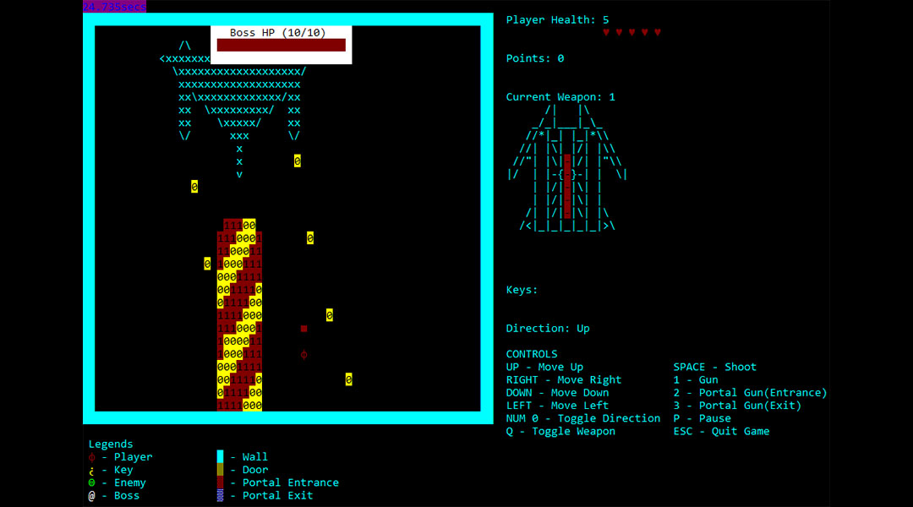

## Project Journal Collection Index

[Index is empty. (Outside the bounds of the array)]

## My Projects
### Trouble Brewin in Space-West

Trouble Brewin in Space-West was developed during the JCU Game Jam 2019 and ended up as a winning entry! It was made by a group of 4. 

It was my first Game Jam and it was a thrilling experience. It was an on site 24 hour game jam, our group  was split into me and my friend Marcus as well as 2 graduated seniors. We scaled really small but worked really well together and ended up taking home the win!

### Community Story

A project handed down 3 batches and finished during my group's term. It was made for Community Chest. Community Story is a City Building with a playable character. It features a cute story alongside the mascot unity and chester. A tile based city builder with quests, shops and a minigame to promote community spirit!

### DUNGEON MASTER SUPER ULTIMATE REMASTERED

A game made for Studio Project 4, Themed Battle Together. It has a movement scheme that deviates from the traditional wasd keys and instead uses a click, drag and release style similar to a slingshot. 

In the game, the player works alongside their uncontrollable allies similar to an RTS but the player is playing a hero unit instead of controlling the whole army, which is what the AI is handling instead! 

### Studio Hero 1

The first studio project I worked on. Fully done in C++, using the command prompt. The Video shows only the portal gun and boss we have but there are 3 whole levels with enemies inside as well as locked doors with appropriate keys for each to unlock before reaching the boss in the first place!  
[Video](https://www.youtube.com/watch?v=NocqESOJLe8)
